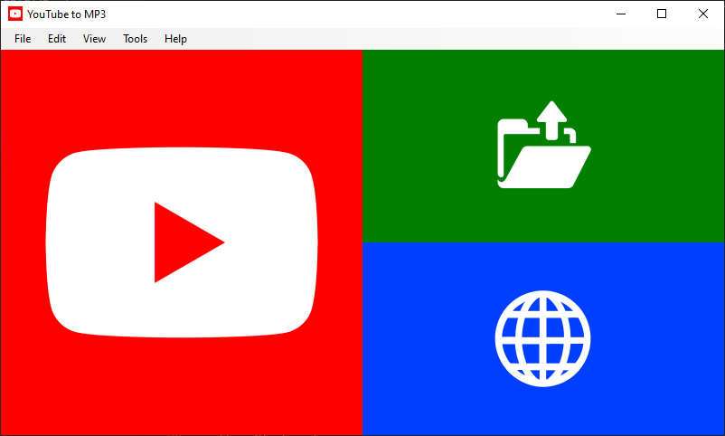

# YouTube to MP3

YouTube to MP3 allows users to download their music from [YouTube](https://www.youtube.com/).

This software should be used for educational or personal backup purposes only!

## Features

- Intuitive user experience
- Responsive user interface design
- Download music at its highest quality available
- Manage what music you want to download or not
- Options to visit YouTube or your downloads directory
- Download selectively or in bulk
- Process queue to enqueue downloads processes efficiently
- Automatically fetch video information from YouTube playlists
- Automatically or manually add YouTube URLs from your clipboard
- Automatically or manually fetch video information
- Load YouTube URLs from files or internet resources
- Shortcuts for almost everything
- Preferences window for more advanced users

## Supported platforms

- Windows

## Dependencies

- ffmpeg
- SharpClipboard
- yt-dlp

## Donation

Please consider donating to the creator of this project at [Ko-fi](https://ko-fi.com/bigeti): https://ko-fi.com/bigeti

## License

You can find the license for this repository [here](https://github.com/BigETI/YouTubeToMP3/blob/main/LICENSE): https://github.com/BigETI/YouTubeToMP3/blob/main/LICENSE